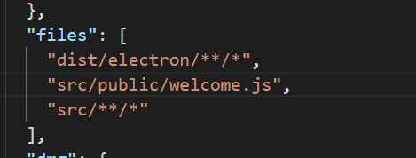

# my-serial

> An electron-vue project
> clone完程序后若serialport缺少
> cnpm install --save serialport
> 安装electron-rebuild, 因为serialport是根据系统环境编译的，当我们安装时，我们编译的成的是系统环境的serialport，所以我们需要重> 新编译成eletron的环境，所以我们需要electron-rebuild
> cnpm install --save-dev electron-rebuild
> 重新编译, 因为我当前版本的electron是1.7.10的，所以我们重新把模块编译成适应1.7.10的, 这里记得要根据你的electron版本编译，我的> 版本是 2.0.4
> ./node_modules/.bin/electron-rebuild -v 2.0.4

>問題：打包完成后應用程序空白並提示not allowed to load local resource,這傻逼問題困擾了我一天了，結果我認爲應該是在打包時沒有將資源打進包中的原因。
>解決方法：在package.json文件中的files中添加上資源存放的路徑。

>參考博客https://blog.csdn.net/xidianyueyong/article/details/98182687
#### Build Setup

``` bash
# install dependencies
npm install

#demo run 
npm run start

# serve with hot reload at localhost:9080
npm run dev

# build electron application for production
npm run build

# run unit & end-to-end tests
npm test

# lint all JS/Vue component files in `src/`
npm run lint

```

---

This project was generated with [electron-vue](https://github.com/SimulatedGREG/electron-vue) using [vue-cli](https://github.com/vuejs/vue-cli). Documentation about the original structure can be found [here](https://simulatedgreg.gitbooks.io/electron-vue/content/index.html).
